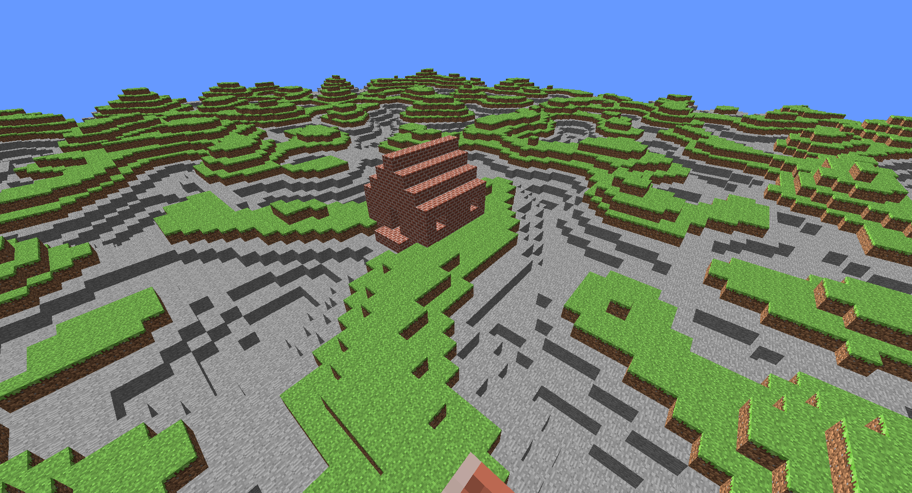

# Mineclone
A simple minecraft clone in C++

This little project was made to understand in depth the inner mechanics of the pure openGL API in C++ and computer graphics in general (vectors, matrices and etc).

The game used C++ for logic and overall functioning and setting openGL parameters and initializations. 

The openGL function loader used was [GLAD](https://www.khronos.org/opengl/wiki/OpenGL_Loading_Library), 
this library is available [here](https://glad.dav1d.de).

As the shading language to comunicate with the GPU, the [GLSL](https://en.wikipedia.org/wiki/OpenGL_Shading_Language) language was used, as it is simple and resembles C/C++ language style.

## Example



This image shows the program functioning as expected.

It is possible to see the textures and illumination working properly, even though it could be improved to resemble the original game, 
the main objective of understanding computer graphics and openGL was accomplished.

## Install

If you wish to test it in your machine you can run these commands to see it.

1. Clone the repo:
```sh
git clone https://github.com/Thales3006/Mineclone
```

2. Build the application:
```sh
# make linux/window (depending of your OS)
make linux
```

3. Run the game:
```sh
./mineclone
```

## Considerations

I plan to upgrade to project in the future in my free time, but this cannot be assured as work and life becomes more agitated.
